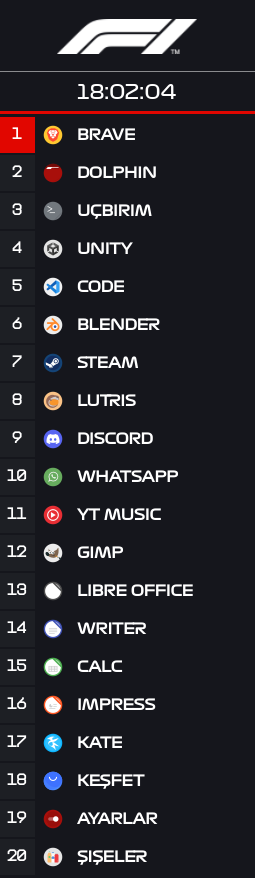
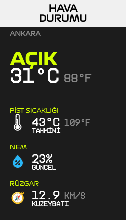

Here are 4 beautiful Plasma 6 widgets for your desktop. I created all of them with the help of AI, and they are fully open-source and ready to use. I haven't tested them on other Linux distributions yet, so if you experience any visual issues, please make sure to install the **Formula1 Display-Regular** and **KH Interference TRIAL** fonts (both downloaded from public resources).

> ⚠️ **Disclaimer:** *This is an unofficial, fan-made project. It is not affiliated, associated, authorized, endorsed by, or in any way officially connected with the Formula One Group or any of its subsidiaries.*

---

# Plasma 6 F1 Widgets Collection

A beautiful collection of Formula 1 inspired widgets for KDE Plasma 6. Created with the help of AI.

## 🏎️ Widgets Included
* **F1 Leaderboard Launcher** (`f1-apps`) - A leaderboard-style application launcher with customizable accent colors.
* **F1 Day/Clock** (`f1-day`) - A sleek date and day display following the iconic F1 race graphics format.
* **F1 Reaction Game** (`f1-reaction`) - Test your reaction times against the five red lights just like an F1 driver.
* **F1 Weather** (`f1-weather`) - Real-time weather data delivered in a track-side information display style.

## ⚙️ Requirements & Installation

If you experience any font rendering or visual alignment issues, please install these fonts on your system manually:
* **Formula1 Display-Regular**
* **KH Interference TRIAL**

### Manual Installation
To install manually, clone this repo or extract the widget folders into your local plasmoids directory:

```bash
~/.local/share/plasma/plasmoids/
```
## SCREENSHOTS





